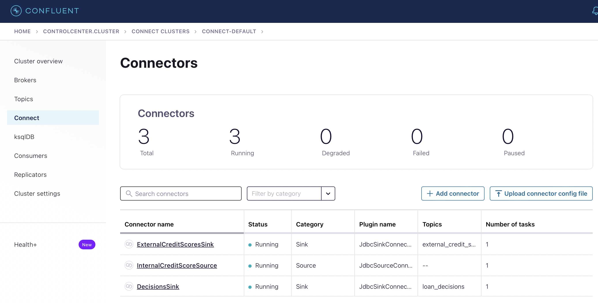

# kafka_checkride
Check-ride project for Confluent bootcamp

### Setup local environment
To run check-ride project locally you need to use Docker file (loan-approval/src/main/resources/docker-compose.yml)
This files is taken from Confluent GitHub project (https://github.com/confluentinc/cp-all-in-one/blob/7.3.0-post/cp-all-in-one/docker-compose.yml) 
and then modify (simplify without rest proxy and ksqldb).

To run it open terminal and type: 
cd loan-approval/src/main/resources/

      docker compose up

When Confluent is ready start Kafka stream application (loan-approval/src/main/java/LoanApprovalApp.java)
Control Center should be available at http://localhost:9021/clusters

----

#### Install connect JDBC plugin:

1. docker-compose exec -u root connect confluent-hub install confluentinc/kafka-connect-jdbc:10.0.0
2. docker-compose restart connect
3. add connector for internal clients (source connector):
   

      curl -X POST -H "Content-Type: application/json" \
      --data-binary "@loan-approval/src/main/resources/connect/connector_internal_scores.json" \
      http://localhost:8083/connectors
4. add connector for loan decisions (sink connector):

      curl -X POST -H "Content-Type: application/json" \
      --data-binary "@loan-approval/src/main/resources/connect/connector_decisions.json" \
      http://localhost:8083/connectors
5. add connector for external credit scores (sink connector):

      curl -X POST -H "Content-Type: application/json" \
      --data-binary "@loan-approval/src/main/resources/connect/connector_external_scores.json" \
      http://localhost:8083/connectors

6. After those steps you should see:

----

#### Other useful commands

Reset consumer group offset (open docker broker terminal)

      kafka-consumer-groups --bootstrap-server localhost:9092 --group loan-approval-app --topic "loan_requests" --reset-offsets --to-earliest --execute
      kafka-consumer-groups --bootstrap-server localhost:9092 --group loan-approval-app --topic "internal_credit_scores" --reset-offsets --to-earliest --execute
      kafka-consumer-groups --bootstrap-server localhost:9092 --group loan-approval-app --topic "loan_decisions" --reset-offsets --to-earliest --execute

Drop topics: 
      
      kafka-topics --bootstrap-server localhost:9092 --topic "loan_requests" --delete
      kafka-topics --bootstrap-server localhost:9092 --topic "loan_decisions" --delete

Delete old schema:

      curl -X DELETE http://localhost:8081/subjects/loan_decisions-value

Access to Postgres:
      
      psql -h postgres -U postgres

#### Test on local environment 
Open terminal and run LoanApprovalApp, then open in another terminal PosLoanApp.

